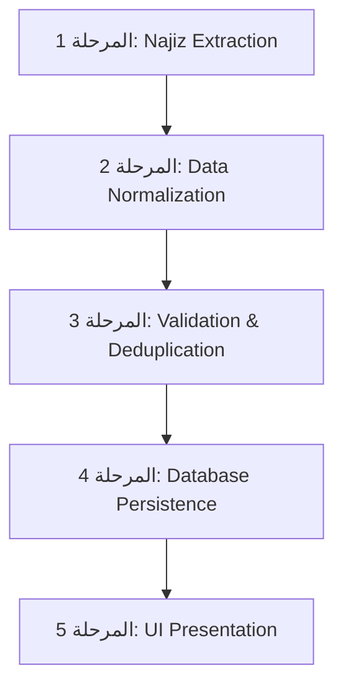

# 🛡️ تقرير الفحص والاعتمادات الشامل وتقييم المخاطر للتكامل مع ناجز (مطابق لبروتوكول التكامل الآمن)

---

## 1. التعهد والالتزام بالأساس العذري (Baseline Protection Commitment)

نؤكد التزامنا التام والجامع بـ **الأساس العذري (Baseline)** للمشروع:
* **ممنوع إجراء أي تعديل مباشر** على قاعدة البيانات أو الواجهات أو منطق الأعمال قبل اعتماد هذا التقرير وخطة التغيير الآمنة.
* **إضافة التكامل تتم بأسلوب الإضافة غير المدمرة (Non-Destructive Extension)**، دون كسر أي وظيفة قائمة، دون حذف أي حقل، ودون فقدان أو تغيير في سلوك النظام الحالي.
* مبدأ العمل الدائم: **Extend > Preserve > Migrate عند الحاجة > Delete كآخر خيار**.

---

## 2. خريطة الاعتمادات الشاملة (Dependency Map)

قبل التفكير في إضافة حقول ناجز، تم حصر ومسح جميع الاعتمادات المتبادلة في الكود الحالي كما يلي:

### أ. حقل رقم القضية (`case_number`)
1. **أين يُعرّف؟**
   * قاعدة البيانات: `cloud-server/src/db/schema/cases.ts:L9` (`case_number: text('case_number').notNull()`).
   * واجهات TypeScript: `src/renderer/src/types/case.ts:L21` (`case_number: string`).
2. **أين يُقرأ ويُعرض في الواجهات؟**
   * جدول القضايا الرئيسي: `src/renderer/src/views/Cases.vue` (عمود رقم القضية ومربع البحث السريع).
   * تفاصيل القضية وغرفة الجلسة: `CaseInfoHeaderCard.vue`, `CaseHeader.vue`, `CaseSidePanels.vue`.
   * التقارير والطباعة: `CourtCasesReport.vue`, `ReportsDashboard.vue`.
3. **أين يُكتب ويُعدّل؟**
   * نموذج إنشاء وتعديل القضية: `src/renderer/src/views/cases/CaseFormDialog.vue:L73`.
   * دالة التحقق من التكرار: `window.api.cases.isUnique(caseNumber)`.
4. **أين يُستخدم في العمليات الخلفية و IPC؟**
   * مسارات الـ API: `cloud-server/src/routes/cases.ts`.
   * إنشاء مجلد الملفات المحلي: `window.api.cases.createCaseFolder({ caseNumber, ... })`.
   * القيد الموحد: `unqCompanyCaseNumber` على مستوى الشركة ورقم القضية.
5. **الجداول والخدمات المرتبطة به:**
   * `cases`, `sessions`, `evidence`, `memoranda`, `judgments`, `tasksV2`, `enforcement_requests`.
6. **تقييم المخاطر:**
   * الحقل مستقر ومتوافق 100% مع أرقام قضايا ناجز المكونة من 10 أرقام. **لا يتطلب أي تغيير**.

---

### ب. جدول الوكالات (`agencies`)
1. **أين يُعرّف؟**
   * قاعدة البيانات: `cloud-server/src/db/schema/clients.ts:L4-L15`.
   * واجهات TypeScript: `src/renderer/src/types/agency.ts:L1-L12` & `api.d.ts:L20`.
2. **أين يُقرأ ويُعرض؟**
   * صفحة إدارة الوكالات: `src/renderer/src/views/POA.vue`.
   * حوارات لوحة التحكم: `DashboardAgencyDialog.vue`.
   * تنبيهات قرب الانتهاء: `window.api.agencies.getExpiryAlerts()`.
3. **أين يُكتب ويُعدّل؟**
   * المتاجر: `src/renderer/src/stores/agencies.ts` (الدوال: `fetchAgencies`, `addAgency`, `updateAgency`, `deleteAgency`).
   * نُظم الأوامر: `window.api.agencies.create` و `window.api.agencies.update`.
4. **ما الجداول المرتبطة به؟**
   * جدول العملاء `clients` عبر المفتاح الأجنبي `client_id` (`references(() => clients.id, { onDelete: 'cascade' })`).
5. **نقاط النقص مقارنة بناجز:**
   * لا يحتوي حالياً على: حالة الوكالة (`status`)، بيانات الوكيل والموكل بالسجل المدني، والنص الكامل للبنود والصلاحيات.
6. **الخطة الآمنة للتوسيع (Non-Destructive Extension):**
   * المحافظة على جميع الحقول القديمة (`agency_number`, `date`, `expiry_date`, `court`, `notes`, `client_id`).
   * إضافة حقول ناجز الجديدة كحقول اختيارية (Nullable) دون المساس بالعلاقات السابقة.

---

### ج. جدول الأحكام (`judgments`)
1. **أين يُعرّف؟**
   * قاعدة البيانات: `cloud-server/src/db/schema/extra.ts:L51-L70`.
   * واجهات TypeScript: `src/renderer/src/types/case.ts` & `api.d.ts:L239`.
2. **أين يُقرأ ويُكتب؟**
   * التعديلات الملحقة: `judgment_amendments` (`extra.ts:L72`).
   * خدمات الـ API: `window.api.judgments.getByCaseId`, `create`, `update`.
3. **مستوى التوافق والخطة:**
   * الجدول مجهز بحقول `judgment_number`, `judgment_date_hijri`, `objection_deadline`, `is_executable`.
   * الإضافة المطلوب إدراجها: حقل `verdict_text` (منطوق الحكم) و `is_final` (هل مكتسب الصفة القطعية)، وهي إضافة غير مدمرة.

---

### د. المرفقات وضبوط الجلسات (`evidence` & `memoranda` & `documents`)
1. **أين تُعرّف حالياً؟**
   * الأدلة: `cloud-server/src/db/schema/extra.ts:L15` (`evidence`).
   * المذكرات: `extra.ts:L84` (`memoranda`).
   * المستندات العامة: `api.d.ts:L337` (`window.api.documents`).
2. **مستوى التوافق والخطر:**
   * ناجز يصدر ضبوط جلسات وصكوك أحكام وعقود كملفات مرفقة. خلط هذه الملفات بين الأدلة والمذكرات قد يسبب تشتت البيانات.
3. **الخطة الآمنة للتوسيع:**
   * إنشاء جدول جديد مخصص للمرفقات المزامنة باسم `case_documents` دون حذف أو تعديل جداول الأدلة والمذكرات الحالية، مما يضمن التوافق الخلفي الكامل 100%.

---

## 3. مصفوفة المطابقة التفصيلية للحقول (Field-by-Field Mapping)

| بيانات ناجز | الحقل الحالي بالنظام | مسار التعريف والكود | نوع البيانات الحالي | مدى التطابق | الإجراء المطلوب | التأثير المتوقع |
| :--- | :--- | :--- | :--- | :--- | :--- | :--- |
| **رقم القضية** | `case_number` | `cases.ts:L9` | `text` | 🟢 **متوافق** | لا تغيّر شيئاً. | منخفض جداً |
| **تصنيف الدعوى الرئيسي** | `main_classification` | `cases.ts:L15` | `text` | 🟢 **متوافق** | لا تغيّر شيئاً. | منخفض جداً |
| **تصنيف الدعوى الفرعي** | `sub_classification` | `cases.ts:L16` | `text` | 🟢 **متوافق** | لا تغيّر شيئاً. | منخفض جداً |
| **المحكمة والدائرة** | `court`, `circuit` | `cases.ts:L18-19` | `text` | 🟢 **متوافق** | لا تغيّر شيئاً. | منخفض جداً |
| **موضوع الدعوى والطلبات** | `subject`, `plaintiff_requests` | `cases.ts:L17, L34` | `text` | 🟢 **متوافق** | لا تغيّر شيئاً. | منخفض جداً |
| **تاريخ القيد الهجري** | `registration_date_hijri` | `cases.ts:L28` | `text` | 🟢 **متوافق** | لا تغيّر شيئاً. | منخفض جداً |
| **أطراف الدعوى والصفات** | `case_parties` | `cases.ts:L55-75` | `table` | 🟢 **متوافق** | لا تغيّر شيئاً. | منخفض جداً |
| **رقم هوية الطرف** | `id_number` | `cases.ts:L65` | `text` | 🟢 **متوافق** | لا تغيّر شيئاً. | منخفض جداً |
| **نوع هوية الطرف (700/سجل)** | مدمج مع `id_number` | `cases.ts:L65` | - | 🟡 **متوافق جزئياً** | إضافة `id_type: text` اختياري. | منخفض (غير مدمر) |
| **أتعاب عقد المكتب** | `contract_amount` | `cases.ts:L30` | `numeric` | 🟢 **خاص بالبرنامج** | الإبقاء عليه كما هو لأتعاب المحاماة. | صفري |
| **مبلغ المطالبة المالية بنجز** | غير مخصص | - | - | 🟡 **متوافق جزئياً** | إضافة `claim_amount: numeric` مستقل. | منخفض (غير مدمر) |
| **تاريخ ووقت الجلسة** | `date`, `time` | `cases.ts:L86, L88` | `date / text` | 🟢 **متوافق** | لا تغيّر شيئاً. | منخفض جداً |
| **رابط الجلسة الإلكترونية** | `meeting_link` | `cases.ts:L93` | `text` | 🟢 **متوافق** | لا تغيّر شيئاً. | منخفض جداً |
| **نوع الجلسة وانعقادها** | غير مفصل | `cases.ts:L89` (`court_room`) | `text` | 🟡 **متوافق جزئياً** | إضافة `session_type`, `hearing_mode` إضافية. | منخفض |
| **صك الحكم وركم الصك** | `judgment_number` | `extra.ts:L63` | `text` | 🟢 **متوافق** | لا تغيّر شيئاً. | منخفض جداً |
| **منطوق الحكم الصادر** | غير مخصص | `extra.ts:L62` | - | 🟡 **متوافق جزئياً** | إضافة `verdict_text: text` اختياري. | منخفض |
| **مرفقات وضبوط ناجز** | `evidence` & `memoranda` | `extra.ts:L15, L84` | `table` | 🟠 **غير متوافق** | إنشاء جدول `case_documents` مستقل. | متوسط (جدول جديد) |
| **تفاصيل نص الوكالة وبنودها**| `agencies` | `clients.ts:L4` | `table` | 🟠 **غير متوافق** | التوسيع غير المدمر لجدول `agencies`. | متوسط (حقول إضافية) |

---

## 4. مصفوفة العمليات والإجراءات (Najiz Operations Mapping Matrix)

| العمليـة | إمكانيتها في ناجز | وجودها بالبرنامج حالياً | مستوى التوافق | الإجراء الفني المطلوب | مستوى الأثر والخطر |
| :--- | :--- | :--- | :--- | :--- | :--- |
| **جلب قضايا حساب المستخدم** | متاح | موجود (`cases.ts`) | 🟢 **متوافق 100%** | مزامنة واستيراد البيانات | منخفض جداً |
| **جلب أطراف الدعوى ورقم الهوية**| متاح | موجود (`case_parties`) | 🟢 **متوافق 100%** | مزامنة أطراف القضية | منخفض جداً |
| **جلب تفاصيل ومواعيد الجلسات** | متاح | موجود (`sessions.ts`) | 🟡 **متوافق جزئياً** | إدراج رابط الاجتماع ونوع الجلسة | منخفض جداً |
| **جلب الوكالات بنص الصلاحيات** | متاح | مقتصر على الرقم والانتهاء | 🟠 **غير متوافق** | توسيع جدول الوكالات واستيراد البنود | متوسط |
| **جلب الأحكام ومنطوق الصكوك** | متاح | موجود جزئياً (`judgments`) | 🟡 **متوافق جزئياً** | إضافة منطوق الحكم وحالة القطعية | منخفض |
| **جلب المرفقات وضبوط الجلسات** | متاح | مشتت بين الأدلة والمذكرات | 🟠 **غير متوافق** | إنشاء جدول مستندات `case_documents` | متوسط |

---

## 5. الفصل الجوهري بين بيانات ناجز وبيانات المكتب الداخلية

تنفيذاً للقاعدة الأساسية رقم (10) بالبروتوكول، تم وضع تصميم صريح يمنع الكتابة العشوائية أو المسح الصامت لبيانات المحامي:

### أ. البيانات التابعة لمنصة ناجز (Najiz Source Data) - [قراءة ومزامنة]:
* رقم القضية، المحكمة، الدائرة القضائية، أطراف الدعوى بالهوية الوطنية، تصنيف الدعوى، تواريخ قيد الدعوى والجلسات، أرقام صكوك الأحكام، ونصوص بنود الوكالات الصادرة.
* **القاعدة:** تُحفظ كما وردت من ناجز كمصدر خارجي موثق ومحمية من التعديل اليدوي العشوائي.

### ب. البيانات الداخلية الخاصة بمكتب المحاماة (Law Firm Internal Data) - [بيانات البرنامج]:
* أتعاب العقد والاتفاق المالي (`contract_amount`).
* تقييم المحامي للقضية واستراتيجيته (`assessment`, `notes`).
* توزيع المهام على الموظفين والمحامين (`responsible_user_id`, `tasksV2`).
* الملاحظات المباشرة والتصنيف الداخلي المخصص للمكتب.
* **القاعدة:** **لا تجوز إعادة كتابة أو مسح أو استبدال هذه البيانات تلقائياً ببيانات ناجز.**

---

## 6. معمارية المزامنة المقسمة (Incremental Sync & Batching Architecture)

نظرًا لاحتمال انتهاء جلسة توثيق نفاذ أثناء المزامنة، تم تصميم معمارية المزامنة المقترحة على **5 مراحل مستقلة**:

### آليات الحماية والتكامل المتواصل:
1. **المزامنة على دفعات (Batch Processing):** استخراج وقراءة كل قضية/وكالة على حدة.
2. **الحفظ اللحظي (Atomic Persistence):** حفظ كل عنصر فور استخراجه بنجاح داخل معاملة مالية/قاعدة بيانات مغلقة (`DB Transaction`).
3. **اكتشاف التكرار (Deduplication):** الاستعلام برقم القضية الكلي أو رقم الوكالة قبل الإدخال؛ لمنع التكرار، وتحديث البيانات المتغيرة فقط عند الحاجة.
4. **معالجة انقطاع نفاذ (Resume Ability):** تسجيل آخِر عنصر تم جلب بنجاح في سجل المزامنة (`sync_logs`). وعند إعادة تسجيل الدخول، يستكمل النظام تلقائياً دون إعادة جلب ما تم استخراجه سابقاً.

---

## 7. خطة حماية قاعدة البيانات والـ Migration الآمن (Safe Migration Plan)

قبل تنفيذ أي Migration مستقبلي (عند اعتماد التقرير):

### إجراءات الحماية المسبقة:
1. **أخذ أخذ أخذ النسخة الاحتياطية الكاملة:**
   * أخذ `Manual DB Backup` كملف `.sql` أو `.sqlite` مستقل.
   * أخذ `Snapshot` كامل للـ Schema الحالية.
   * إحصاء وتسجيل عدد السجلات الكلي في جميع الجداول (`Record Count Audit`).
2. **ضوابط الـ Migration:**
   * **ممنوع استخدام أي `Destructive Migration`** (ممنوع تنفيذ `DROP COLUMN`, `DROP TABLE`, أو `ALTER COLUMN RENAME`).
   * إضافة الحقول الجديدة بخصائص `DEFAULT NULL` أو `DEFAULT ''` لضمان عدم تأثيرها على البيانات الحالية.
   * اختبار الـ Migration على قاعدة بيانات تجريبية معزولة قبل التطبيق.
3. **دورة حياة الـ Migration لكل حقل إضافي:**
   $$\text{Before Checklist} \longrightarrow \text{Non-Destructive Migration} \longrightarrow \text{Integrity Validation} \longrightarrow \text{Rollback Script}$$

---

## 8. خطة حماية الواجهات والأداء (UI & Performance Preservation)

1. **حماية نماذج إدخال البيانات الحالية:**
   * نماذج إدخال القضايا (`CaseFormDialog.vue`) والوكالات والجلسات ستبقى تعمل بنفس الحقول والشكل المعتاد دون إجبار المستخدم على ملء حقول ناجز الجديدة عند الإدخال اليدوي.
2. **إضافة خيار المزامنة بمرونة:**
   * إضافة زر مستقل **"مزامنة من ناجز"** أو **"استيراد بيانات القضية"** داخل الصفحات المعنية دون تغيير تخطيط الواجهة الأساسي.
3. **حالات Loading/Error/Empty:**
   * إظهار مؤشرات تقدم واضحة أثناء عملية الاستخراج دون تجميد شاشة المستخدم (Non-blocking Async Operations).

---

## 9. خطة الاختبارات والتحقق الشاملة (Comprehensive Test Plan)

قبل إعلان اكتمال ميزة التكامل مستقبلاً، سيتم تطبيق الاختبارات السبعة التالية:

1. **اختبار الانكفاء والتراجع على قاعدة البيانات (Database Regression Test):**
   * التأكد من أن جميع العلاقات بالمفاتيح الأجنبية والجداول تعمل بنفس كفاءة الـ Baseline.
2. **اختبار سلامة الخدمات الخلفية (Backend Regression Test):**
   * التأكد من أن جميع دوال الـ API الحالية تعمل دون أي خطأ.
3. **اختبار سلامة واجهات المستخدم (Frontend Regression Test):**
   * التأكد من عمل نماذج الإضافة والتعديل والحذف للقضايا والعملاء والجلسات دستوب وموبايل.
4. **اختبار سلامة البيانات القديمة (Data Integrity Test):**
   * المطابقة الحرفية بين عدد السجلات وبياناتها قبل وبعد التعديل للتأكد من عدم فقدان أي حرف.
5. **اختبار الاستئناف والمزامنة (Sync Resume & Timeout Test):**
   * قطع الاتصال متعقداً أثناء المزامنة واختبار قدرة النظام على استكمال العمل دون تكرار.
6. **اختبار التكرار (Deduplication Test):**
   * محاولة استيراد نفس القضية أو الوكالة مرتين والتأكد مندم التكرار في قاعدة البيانات.
7. **اختبار التراجع والعودة (Rollback Test):**
   * تجربة تشغيل سكريبت الـ Rollback للتأكد من إمكانية استعادة قاعدة البيانات للحالة السابقة في ثوانٍ معدودة.

---

## 10. التوصية ومطلب الاعتماد

**بناءً على بروتوكول التكامل المعتمد:**
* **لم يتم تعديل أي ملف في كود المشروع الحقيقي أو قاعدة البيانات حتى الآن.**
* تم إنجاز الفحص كاملاً وإعداد خريطة الاعتمادات ومصفوفة المطابقة التفصيلية وخطة المزامنة غير المدمرة.
* هذا التقرير مرفوع بالكامل لمراجعتكم واعتماده قبل الانتقال لأي خطوة تنفيذية.
