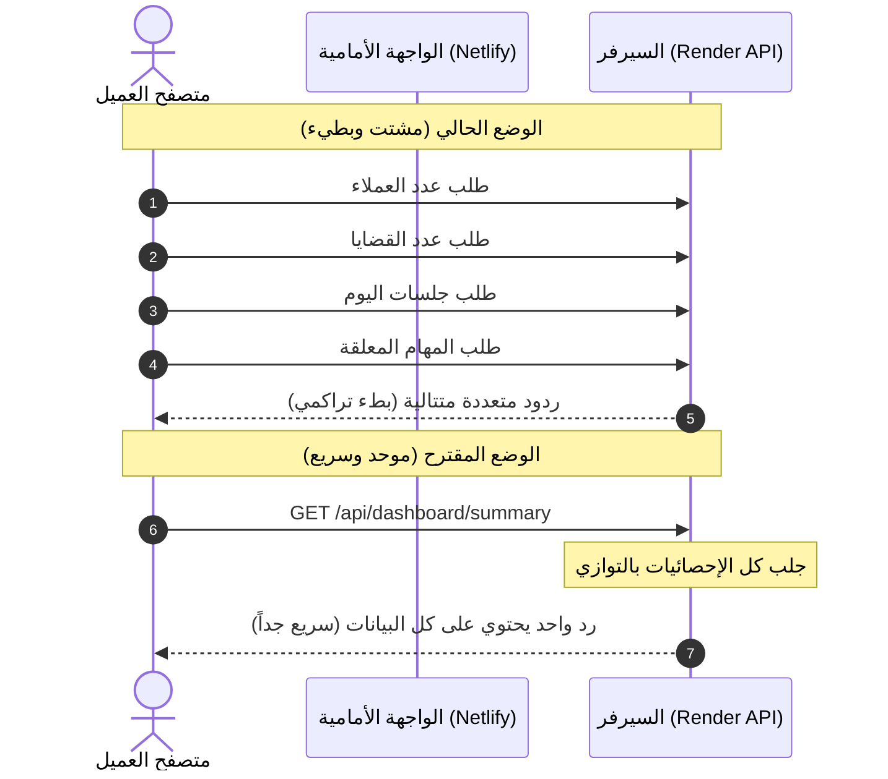

# تقرير تحليل أداء موقع B2B-LAW والحلول المقترحة

تم إجراء فحص شامل للبنية التحتية والشبكة والكود المصدري للموقع الإلكتروني [b2b-law.netlify.app](https://b2b-law.netlify.app/)، وتم تحديد أسباب البطء الملحوظ الذي يشتكي منه العملاء بدقة. يوضح هذا التقرير الأسباب الرئيسية والحلول المقترحة لتحويل تجربة المستخدم إلى تجربة سريعة وسلسة.

---

## 📊 الأسباب الرئيسية للبطء (Root Causes of Slowness)

### 1. خمول واستيقاظ الخادم (Render.com Cold Starts) — **المشكلة الكبرى 🔴**

- **السبب:** السيرفر الخاص بالخلفية (API Backend) مستضاف على المنصة السحابية **Render.com** (على الرابط `https://b2b-law-g2qr.onrender.com`). في الخطة المجانية لـ Render، يدخل الخادم في وضع النوم (Spin down) تلقائياً بعد 15 دقيقة من عدم وجود أي نشاط.
- **الأثر:** عندما يفتح العميل الموقع بعد فترة انقطاع، يستغرق السيرفر ما بين **50 ثانية إلى دقيقتين كاملتين (Cold Start)** للاستيقاظ، وتحميل الحاوية (Container)، والاتصال بقاعدة البيانات. خلال هذه الفترة، يرى العميل شاشة تحميل فارغة تماماً ويعتقد أن الموقع معطل أو بطيء جداً.

### 2. شلال الطلبات البرمجية المتتالية (API Request Waterfall) 🟡

- **السبب:** عند دخول العميل إلى لوحة التحكم (Dashboard)، يقوم كود الواجهة الأمامية في ملف [Dashboard.vue](file:///g:/w2w/src/renderer/src/views/Dashboard.vue) و [App.vue](file:///g:/w2w/src/renderer/src/App.vue) بإطلاق ما يقارب **12 إلى 18 طلباً برمجياً (HTTP Requests)** بشكل متزامن ومتتابع للحصول على البيانات (مثل: عدد العملاء، عدد القضايا، الجلسات، التنبيهات، المهام المعلقة، تفاصيل الاشتراك، وغيرها).
- **الأثر:** إرسال هذا العدد الهائل من الطلبات الفردية عبر الشبكة يزيد من وقت الاستجابة التراكمي (Latency)، خاصة إذا كان العميل يتصفح من شبكة جوال، حيث يتعين على المتصفح انتظار كل هذه الردود الفردية لعرض الصفحة.

### 3. معالجة الاستعلامات المتتالية في الخلفية (Sequential DB Queries) 🟡

- **السبب:** في نظام المسارات العام بالخلفية [entity.ts](file:///g:/w2w/cloud-server/src/routes/entity.ts#L108-L113)، يتم التعامل مع طلبات القوائم عبر تنفيذ استعلامين لقاعدة البيانات بشكل متتالٍ باستخدام `await`:
  1. الاستعلام الأول: حساب العدد الإجمالي (`COUNT(*)`)
  2. الاستعلام الثاني: جلب السجلات الفعلية (`SELECT *`)
- **الأثر:** السيرفر لا يبدأ بجلب البيانات حتى ينتهي تماماً من حساب العدد الإجمالي، مما يضاعف وقت الاستجابة الخاص بقاعدة البيانات لكل جدول يتم تحميله.

### 4. قيود مجمع الاتصالات بقاعدة البيانات (Connection Pool Limitation) 🟢

- **السبب:** تم تهيئة مجمع اتصالات قاعدة البيانات (Connection Pool) في [connection.ts](file:///g:/w2w/cloud-server/src/db/connection.ts#L40-L41) بحد أقصى **5 اتصالات فقط** (`max: 5`).
- **الأثر:** مع زيادة عدد المستخدمين المتزامنين، تضطر الطلبات الجديدة للانتظار في الطابور لحين تحرر اتصال من الاتصالات الخمسة، مما يسبب بطئاً شديداً وتأخراً في الاستجابة عند الاستخدام الجماعي.

---

## 🛠️ الحلول المقترحة (Recommended Solutions)

### الحل العاجل والفوري (Quick Win)

> [!IMPORTANT]
> **ترقية خطة استضافة السيرفر على Render.com**
>
> - **التكلفة:** تبدأ من 7$ شهرياً فقط.
> - **النتيجة:** تلغي ميزة "النوم تلقائياً" (Spin down) نهائياً، ويظل السيرفر نشطاً ومستيقظاً 24/7. هذا الحل سيقضي فوراً على مشكلة الانتظار لدقيقة أو دقيقتين عند أول دخول للموقع.

---

### الحلول البرمجية الفنية (Technical Code Optimizations)

#### 1. دمج طلبات لوحة التحكم (API Consolidation)

بدلاً من قيام المتصفح بطلب 18 طلباً منفصلاً، يتم إنشاء مسار موحد في السيرفر (Endpoint) يسمى `/api/dashboard/summary` يقوم بجمع كل البيانات المطلوبة للوحة التحكم في استعلام واحد كبير أو موازٍ، وإعادتها دفعة واحدة.



#### 2. تحسين معالجة استعلامات قاعدة البيانات بالتوازي (Parallel Queries)

تعديل الكود في [entity.ts](file:///g:/w2w/cloud-server/src/routes/entity.ts) لتشغيل استعلام العد وجلب البيانات بالتوازي باستخدام `Promise.all`:

```diff
- const countResult = await query(`SELECT COUNT(*) FROM ${table} ${whereClause}`, params)
- const dataResult = await query(
-   `SELECT * FROM ${table} ${whereClause} ORDER BY created_at DESC LIMIT $${paramIndex} OFFSET $${paramIndex + 1}`,
-   [...params, limit, offset]
- )
+ const [countResult, dataResult] = await Promise.all([
+   query(`SELECT COUNT(*) FROM ${table} ${whereClause}`, params),
+   query(
+     `SELECT * FROM ${table} ${whereClause} ORDER BY created_at DESC LIMIT $${paramIndex} OFFSET $${paramIndex + 1}`,
+     [...params, limit, offset]
+   )
+ ])
```

#### 3. توسيع مجمع اتصالات قاعدة البيانات

تعديل الإعدادات في [connection.ts](file:///g:/w2w/cloud-server/src/db/connection.ts) لرفع كفاءة معالجة الطلبات المتزامنة:

```diff
 const pool = new Pool({
   connectionString: process.env.DATABASE_URL || 'postgresql://localhost:5432/b2b_law',
-  max: 5,
-  min: 1,
+  max: 20,
+  min: 2,
   idleTimeoutMillis: 10000,
```

#### 4. إيقاظ السيرفر المؤقت مجاناً (Workaround Pinger)

إذا لم تكن الترقية المدفوعة لـ Render متاحة حالياً، يمكن استخدام خدمة مجانية مثل **UptimeRobot** لتقوم بإرسال طلب (Ping) إلى رابط فحص الحالة `https://b2b-law-g2qr.onrender.com/health` كل 10 دقائق لمنع السيرفر من النوم.

---

## 📋 خطة العمل المقترحة (Action Plan)

| خطوة العمل                              | مستوى الأهمية | التأثير المتوقع                                     | الصعوبة التقديرية                      |
| :-------------------------------------- | :------------ | :-------------------------------------------------- | :------------------------------------- |
| **1. ترقية سيرفر Render**               | 🔴 حرجة جداً  | يقضي على تأخير البداية (Cold Start) بنسبة 100%      | سهلة جداً (إعدادات الحساب)             |
| **2. موازاة استعلامات قاعدة البيانات**  | 🟡 عالية      | تقليل وقت استجابة الصفحات بنسبة 40%                 | سهلة (تعديل طفيف بالكود)               |
| **3. زيادة عدد اتصالات قاعدة البيانات** | 🟡 متوسطة     | منع انهيار أو بطء الموقع عند تصفح عدة مستخدمين معاً | سهلة (تعديل سطر كود)                   |
| **4. دمج طلبات لوحة التحكم**            | 🟢 اختيارية   | تخفيف العبء على الشبكة وتسريع تطبيق الجوال والموقع  | متوسطة (تحتاج تعديل بالخلفية والواجهة) |
